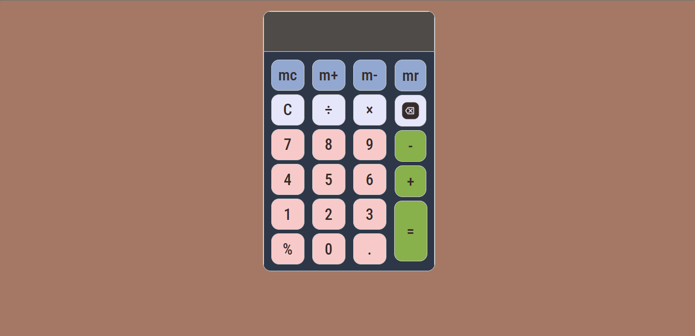

# Calculator UI

A simple calculator user interface built using HTML and CSS.

## 🚀 Features

* Clean layout using Flexbox
* Interactive hover and click effects
* Button-based calculator design

## 🛠️ Tech Used

* HTML
* CSS

## 📌 Project Status

UI completed.
Functionality (JavaScript) will be added in future.

## 📷 Preview

---

Made for practice and learning frontend development.
