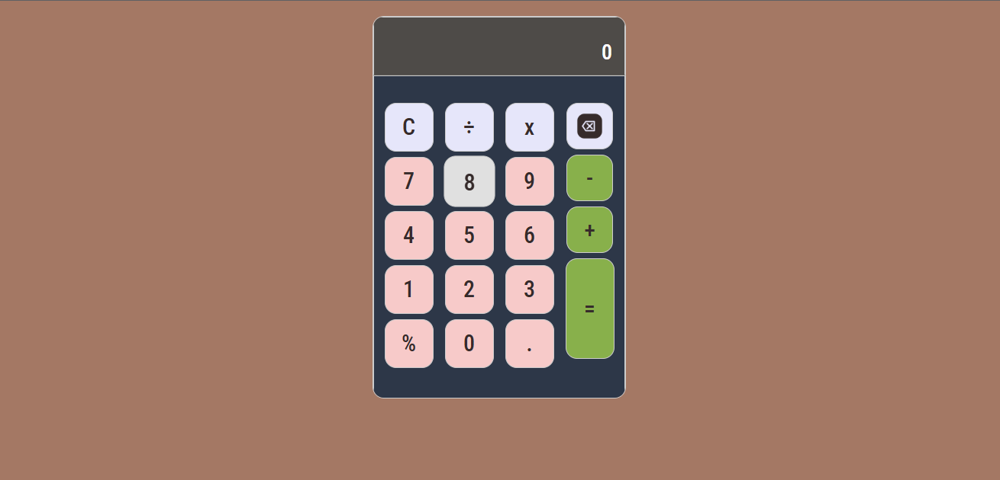

# 🧮 Calculator

A simple calculator built with **HTML, CSS, and Vanilla JavaScript**.

This project was created to practice JavaScript fundamentals by implementing calculator logic from scratch—without using `eval()`. Along the way, I learned how to manage application state, handle user interactions, and build a responsive interface.

---

## ✨ Features

* ➕ Addition
* ➖ Subtraction
* ✖️ Multiplication
* ➗ Division
* 📊 Percentage calculations
* 🔢 Decimal number support
* ⌫ Backspace/Delete button
* 🧹 Clear (`C`) button
* 🔄 Chained calculations
* ⚠️ Division-by-zero error handling
* 🎨 Interactive button hover & click animations

---

## 🛠️ Built With

* HTML5
* CSS3
* Vanilla JavaScript

---

## 📸 Preview




---

## 🚀 Getting Started

Clone the repository:

```bash
git clone https://github.com/<your-username>/calculator.git
```

Open `index.html` in your browser, and you're ready to use the calculator.

---

## 📚 What I Learned

Building this project helped me understand:

* DOM manipulation
* Event listeners
* Managing application state
* JavaScript functions
* Error handling
* Writing cleaner, modular code

---


⭐ If you liked this project, feel free to star the repository!
